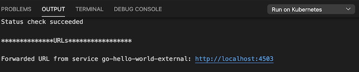
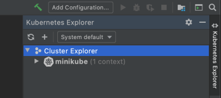
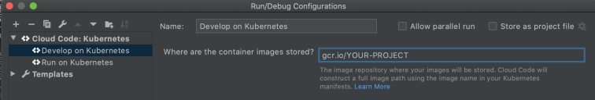
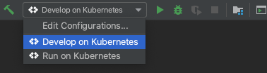
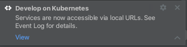

# Kubernetes Custom Sample

This custom sample creates a basic Kubernetes web application with a frontend and backend service. The sample files include logic to make HTTP requests, read from and write to a database, and display content. The sample can be customized to build a dynamic application.

For instructions on setting up your own Custom Sample repository, read the [Custom Samples documentation](https://cloud.google.com/code/docs/vscode/set-up-template-repo?utm_source=ext&utm_medium=partner&utm_campaign=CDR_kri_gcp_cloudcodereadmes_012521&utm_content=-).

---

## Table of contents
- [Sample contents](#sample-contents)
- [Examples](#examples)
- [Deploying with VS Code](#deploying-with-vs-code)
- [Deploying with IntelliJ](#deploying-with-intellij)
- [Sign up for user research](#sign-up-for-user-research)

---

## Sample contents

The Kubernetes custom sample contains a **skaffold.yaml** and Kubernetes manifest yamls for each service. When you deploy the app with Cloud Code, it uses [skaffold](https://skaffold.dev/docs/) to build an image and deploy the project's Kubernetes manifests.

- **skaffold.yaml** configures how to build the app
- **/kubernetes-manifests** contains the Kubernetes yaml manifests

### [frontend](./src/frontend)

The frontend service creates a standard webpage using Node.js and Pug.

- **app.js** starts an HTTP server and handles requests
- **/views** contains the following views:
  - **home.pug** the main display page
  - **input.pug** contains a form for users to enter and submit input
  - **output.pug** displays rendered content from the database
- **/public** contains two folders:
    - **/assets**: contains image files
    - **/css**: contains a single **style.css** file

### [backend](./src/backend)

The backend service manages requests to a MongoDB database.

- **app.js** starts an HTTP server and connects to the database
- **/routes** contains two files:
  - **index.js** handles requests from the frontend service to the database
  - **db.js** includes logic for connecting to and querying the database

---

## Examples

For an example of an application built using this sample, see the [Cloud Code "Guestbook" sample](https://github.com/GoogleCloudPlatform/cloud-code-samples/tree/master/nodejs/nodejs-guestbook).

Are you using the Kubernetes custom sample to build an app? Let us know by joining the **#cloud-code** channel in the [Google Cloud Platform Slack community](https://join.slack.com/t/googlecloud-community/shared_invite/zt-erdf4ity-8ZMUQ18DYV~5hkbZ~gCswg)!

---

## Deploying with VS Code

For details on how to deploy this sample with Cloud Code, read the Cloud Code for [VS Code documentation](https://cloud.google.com/code/docs/vscode/quickstart-local-dev?utm_source=ext&utm_medium=partner&utm_campaign=CDR_kri_gcp_cloudcodereadmes_012521&utm_content=-).

### Run the app locally with minikube

1. To run your application, click on the Cloud Code status bar and select ‘Run on Kubernetes’.  
 

2. Select ‘Run locally using minikube’ when prompted. Cloud Code runs your app in a local [minikube](https://minikube.sigs.k8s.io/docs/start/) cluster.  

3. View the build progress in the OUTPUT window. Once the build has finished, click on the URL in the OUTPUT window to view your live application.  

4.  To stop the application, click the stop icon on the Debug Toolbar.

---

## Deploying with IntelliJ

For details on how to deploy this sample with Cloud Code, read the Cloud Code for [IntelliJ documentation](https://cloud.google.com/code/docs/intellij/quickstart-k8s?utm_source=ext&utm_medium=partner&utm_campaign=CDR_kri_gcp_cloudcodereadmes_012521&utm_content=-).

### Run the app locally with minikube

#### Start a minikube cluster
1. Navigate to the Kubernetes Explorer from the right side panel, or by going to **Tools > Cloud Code > Kubernetes > View Cluster Explorer**. 

2. If the Cluster Explorer is empty, go to the terminal and run 'minikube start'.  

3. Once minikube has started, it will be displayed in the Cluster Explorer. Minikube will be set as the current context by default. To switch contexts, right click on a different cluster in the Cluster Explorer and select 'Set as Current Context'.  

#### Run the app on minikube
1. Click the Run/Debug configurations dropdown on the top taskbar and select 'Edit Configurations'. Select 'Develop on Kubernetes'. You may need to specify your [container image repository](https://cloud.google.com/code/docs/intellij/configuring-container-image-settings?utm_source=ext&utm_medium=partner&utm_campaign=CDR_kri_gcp_cloudcodereadmes_012521&utm_content=-).  

2. Click 'OK' to save your configuration. 

3. Select 'Develop on Kubernetes' from the configuration drop down and click the run icon. Cloud Code runs your app in a local [minikube](ttps://minikube.sigs.k8s.io/docs/start/) cluster.  

4. View the build process in the output window. Once the build has finished, you will receive a notification from the Event Log. Click 'View' to access the local URLs for your deployed services. The URLs remain accessible through the Event Log dialog.  

5.  To stop the application, click the stop icon next to the configuration dropdown.

---

## Sign up for user research

We want to hear your feedback!

The Cloud Code team is inviting our user community to sign-up to participate in Google User Experience Research. 

If you’re invited to join a study, you may try out a new product or tell us what you think about the products you use every day. At this time, Google is only sending invitations for upcoming remote studies. Once a study is complete, you’ll receive a token of thanks for your participation such as a gift card or some Google swag. 

[Sign up using this link](https://google.qualtrics.com/jfe/form/SV_4Me7SiMewdvVYhL?reserved=1&utm_source=In-product&Q_Language=en&utm_medium=own_prd&utm_campaign=Q1&productTag=clou&campaignDate=January2021&referral_code=UXbT481079) and answer a few questions about yourself, as this will help our research team match you to studies that are a great fit.
